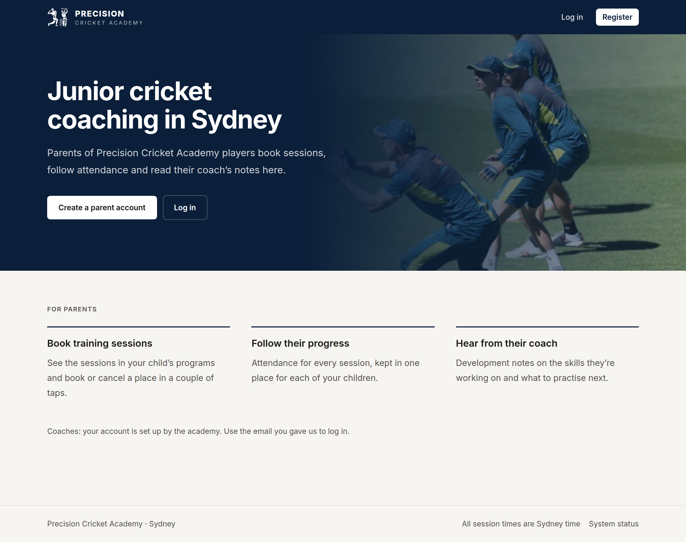
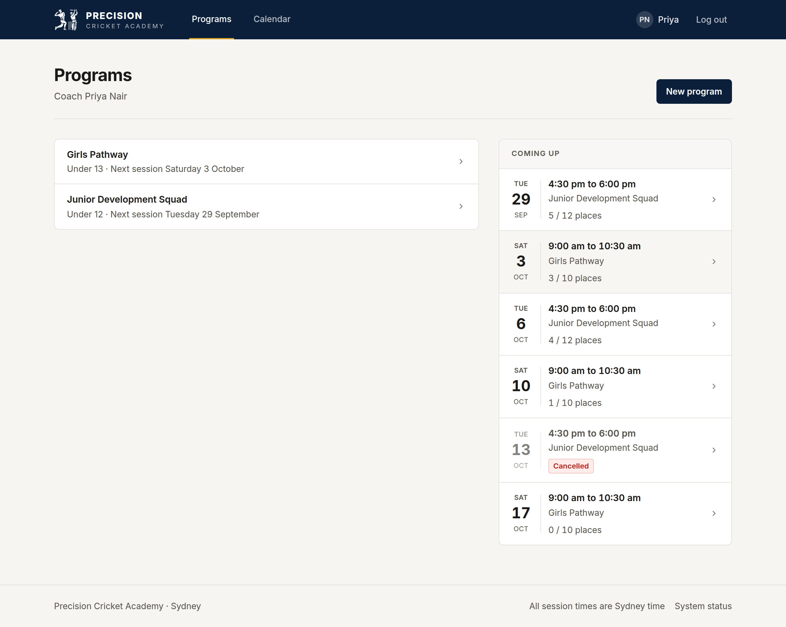
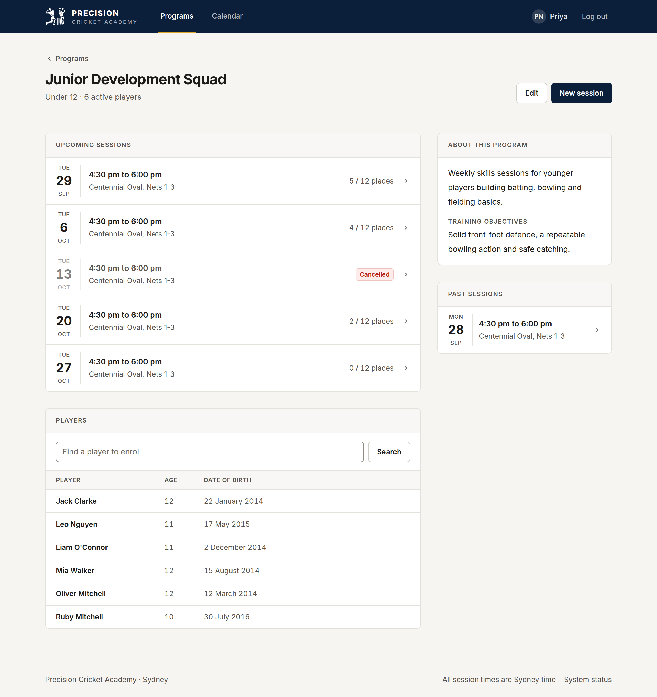
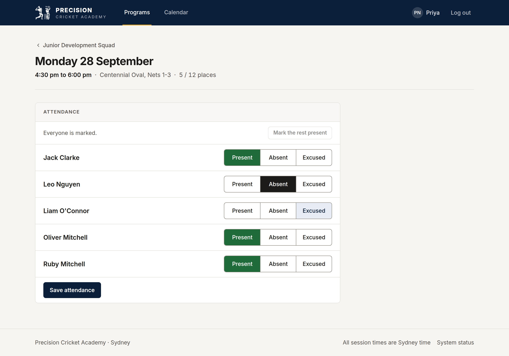
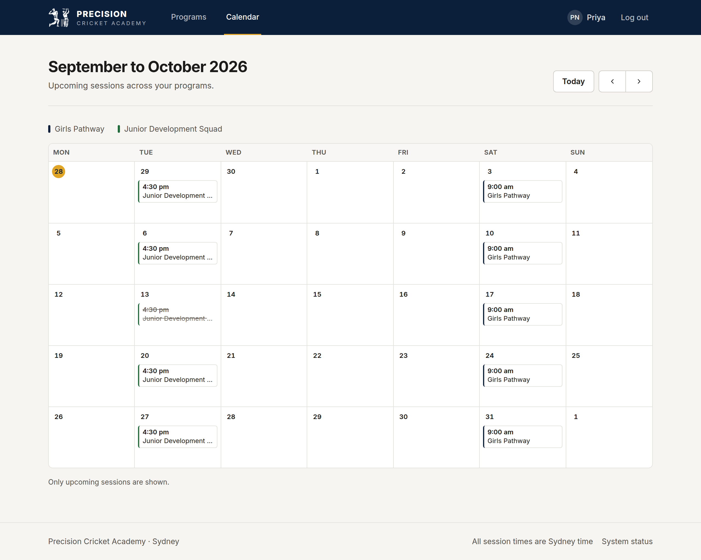
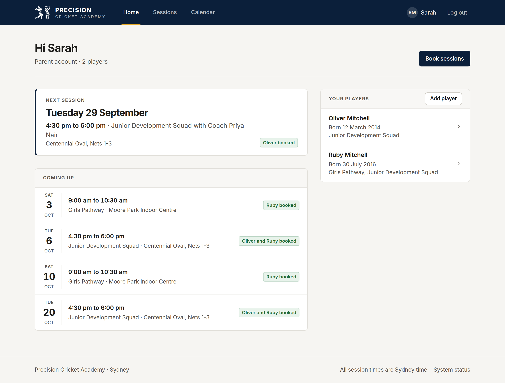
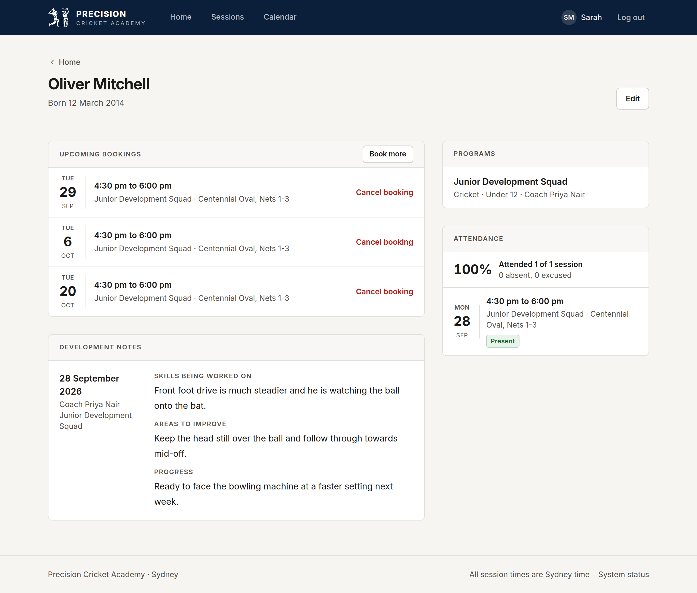
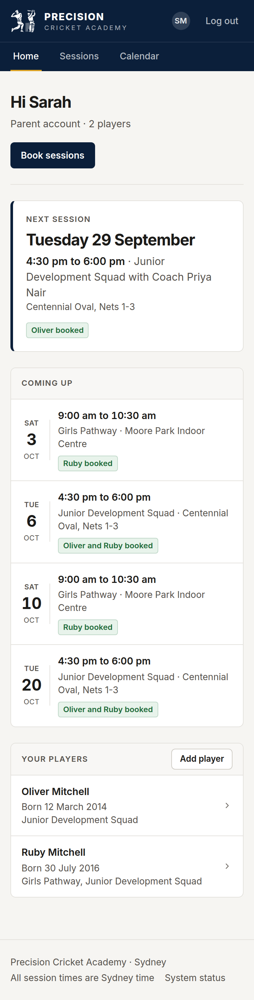
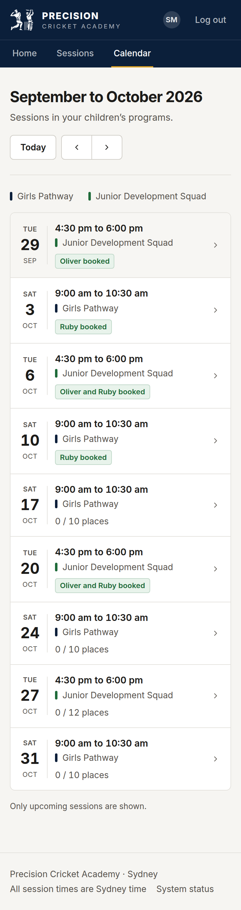

# Sports Academy Management Platform

A web app for running a sports academy: training programs, sessions, bookings, attendance and player development. I'm building it around a cricket academy first, but the data model isn't tied to cricket, so it could be used for other sports later.

The idea comes from helping run a cricket coaching academy. A lot of the work there, like tracking who is booked into which session, taking attendance and keeping notes on players, is done by hand. This project is my attempt to put all of that in one place.

## Screenshots

These are from the current version of the app, branded as Precision Cricket Academy. The people and sessions are made-up test data.

<p align="center"></p>

<table>
  <tr>
    <td align="center" valign="top" width="33%">Coach's programs<br></td>
    <td align="center" valign="top" width="33%">Sessions and players in a program<br></td>
    <td align="center" valign="top" width="33%">Taking attendance<br></td>
  </tr>
  <tr>
    <td align="center" valign="top" width="33%">Calendar of upcoming sessions<br></td>
    <td align="center" valign="top" width="33%">Parent's home page<br></td>
    <td align="center" valign="top" width="33%">A child's attendance and notes<br></td>
  </tr>
</table>

On a phone:

<p>
  
  
</p>

More screenshots from each phase are in [docs/screenshots](docs/screenshots/).

## Project status

**Phases 1 to 5 (Foundation, Authentication, Core management, Sessions and bookings, and Attendance and development) are done. That's everything in the MVP. Phase 5b gave the frontend a proper design for Precision Cricket Academy.**

Phase 7 is a free live demo with made-up data, on Vercel, Render and Neon. How it's set up is in [docs/deployment.md](docs/deployment.md). A proper production deployment and Phase 6 (Payments) are future improvements. They aren't planned as of right now.

What exists right now:

* A FastAPI backend with health checks, parent registration, login and a `/users/me` endpoint
* JWT access tokens, refresh tokens in an httpOnly cookie, Argon2 password hashing and role checks (Coach and Parent)
* A script for creating coach accounts (public sign-up only creates parents)
* Parents can add their children as players and see which programs they're in
* Coaches can create programs, search for players by name and enrol them, and make an enrolment inactive or active again
* Coaches can add training sessions to their programs with a capacity, edit them, cancel them, and see who's booked
* Parents can book their children into sessions in their programs, see how many places are left, and cancel a booking before the session starts
* Coaches can mark booked players as present, absent or excused once a session has started, and write development notes about players in their programs
* Parents can see their child's attendance and every development note about them
* A React frontend with login, register, a coach area, a parent area and an account page, branded as Precision Cricket Academy
* A calendar page where coaches and parents see upcoming sessions by month
* PostgreSQL running in Docker, with tables for users, refresh tokens, players, sports (Cricket for now), programs, enrolments, training sessions, bookings, attendance and development notes, managed by Alembic
* Backend, frontend and end-to-end tests
* A GitHub Actions CI pipeline

You stay logged in for 7 days, even after refreshing the page or closing the browser. Logging out ends the login on the server as well as in the browser.

A child's date of birth is only shown to their parents and to the coaches of programs they're enrolled in. When a coach searches for a player, they see the name and the parents' first names, so two children with the same name can be told apart.

Two parents can't both take the last place in a session. Each booking locks the session's row while it checks and updates the count, and the database also refuses a booked count higher than the capacity. Session times are stored in UTC and shown in Sydney time, whatever time zone your computer is in.

A coach only sees the attendance and notes from their own programs. If a child is in two coaches' programs, neither coach sees what the other wrote, but the parents see all of it.

Screenshots from Phase 2 are in [docs/screenshots/phase-2](docs/screenshots/phase-2/).
Screenshots from Phase 4 are in [docs/screenshots/phase-4](docs/screenshots/phase-4/).
Screenshots from Phase 5 are in [docs/screenshots/phase-5](docs/screenshots/phase-5/).
Screenshots from Phase 5b are in [docs/screenshots/phase-5b](docs/screenshots/phase-5b/).

Everything else in this README describes planned features. The development phases are listed in [docs/project_specs.md](docs/project_specs.md#12-development-phases).

## Technology

| Area | Choice |
|---|---|
| Frontend | React, TypeScript, Vite, Tailwind CSS |
| Backend | Python, FastAPI, SQLAlchemy, Alembic |
| Database | PostgreSQL |
| Authentication | JWT access tokens, Argon2 password hashing |
| Testing | pytest, Vitest, Playwright |
| Local environment | Docker Compose |
| CI | GitHub Actions |
| Deployment | Free live demo on Vercel (frontend), Render (backend) and Neon (database). See [docs/deployment.md](docs/deployment.md). |

### Pinned versions

Runtime versions are pinned so the project behaves the same on my machine, in Docker and in CI.

| Component | Version | Pinned in |
|---|---|---|
| Python | 3.12.14 | `backend/.python-version`, `backend/Dockerfile` |
| uv | 0.12.19 | `backend/Dockerfile`, `.github/workflows/ci.yml` |
| Node.js | 24.21.0 (LTS) | `frontend/.nvmrc`, `frontend/Dockerfile`, `frontend/package.json` |
| PostgreSQL | 17.11 | `docker-compose.yml`, `.github/workflows/ci.yml` |
| Python packages | exact versions | `backend/pyproject.toml`, `backend/uv.lock` |
| npm packages | exact versions | `frontend/package.json`, `frontend/package-lock.json` |

When upgrading a runtime, update every file in its row in the same pull request.

## Planned features

The platform is coach-led. There are three roles: **Coach**, **Parent** and **Player**.

**Coaches** will:

* create training programs and enrol players into them
* create sessions and set each session's capacity
* see who is booked into their sessions
* record attendance and player development notes

Coach accounts will be created with a script rather than through public sign-up.

**Parents** will:

* register an account
* add and manage their children's profiles
* book their children into sessions for programs they're enrolled in
* see upcoming sessions, attendance and development notes

**Players** start as a profile managed by a parent. A player login is optional and can be added later. With a login, a player can see their own schedule, attendance and development notes.

Payments and invoices would be a future improvement (Phase 6). They aren't planned right now.

### Session capacity

Every session has a session capacity, which is the number of players it can accept:

```text
Saturday Training, 10:00 AM – 11:30 AM
capacity  = 10
booked    = 7
available = 3
```

When `available` reaches 0, no more bookings are accepted. The backend will check this inside a database transaction, so two parents booking the last place at the same moment can't both succeed.

## Getting started

### Prerequisites

* [Docker Desktop](https://www.docker.com/products/docker-desktop/)
* Git
* Node.js 24.21.0 (only needed to run the Playwright tests)

On Windows, the project runs best when cloned inside WSL 2. If the repository is on the Windows filesystem and code changes aren't picked up, set `WATCH_POLLING=true` in `.env`.

### Running the project

```bash
cp .env.example .env
docker compose up --build
```

In a second terminal, apply the database migrations:

```bash
docker compose exec backend alembic upgrade head
```

To log in as a coach, create a coach account first. The script asks for a password:

```bash
docker compose exec backend python -m scripts.create_coach \
  --email coach@example.com --first-name Sam --last-name Lee
```

Parents can sign up themselves at http://localhost:5173/register.

| URL | What it is |
|---|---|
| http://localhost:5173 | Frontend |
| http://localhost:5173/status | Shows whether the API and database are up |
| http://localhost:8000/api/v1/health | Backend health check |
| http://localhost:8000/docs | API documentation generated by FastAPI |

### Common commands

```bash
# Stop the stack (database data is kept)
docker compose down

# Stop the stack and delete the database volume
docker compose down -v

# Backend checks (tests run against the academy_test database)
docker compose exec backend ruff check .
docker compose exec backend ruff format --check .
docker compose exec backend pytest

# Frontend checks
docker compose exec frontend npm run lint
docker compose exec frontend npm run typecheck
docker compose exec frontend npm test
docker compose exec frontend npm run build
```

### End-to-end tests

Playwright runs on your machine against the running stack. Run `npm ci` on your machine **before** the first `docker compose up`. If you don't, Docker can create an empty, root-owned `frontend/node_modules` folder that makes `npm ci` fail.

```bash
cd frontend
npm ci
npx playwright install chromium
cd ..
docker compose up --build -d
docker compose exec backend alembic upgrade head

# The login, program, session and attendance tests expect this coach account to exist
docker compose exec -e COACH_PASSWORD=e2e-coach-password backend \
  python -m scripts.create_coach --email e2e-coach@example.com --first-name E2E --last-name Coach

cd frontend
npm run test:e2e
```

## Repository structure

```text
.
├── backend/                 FastAPI app, Alembic migrations, pytest tests
├── frontend/                React app, Vitest tests, Playwright tests (e2e/)
├── docker/postgres/init/    Creates the academy_test database
├── docs/                    Specification, architecture notes and decision records
├── .github/                 CI workflow and Dependabot config
└── docker-compose.yml       Local development stack
```

More detail is in [docs/architecture.md](docs/architecture.md).

## Licence

This is a personal portfolio and learning project.
